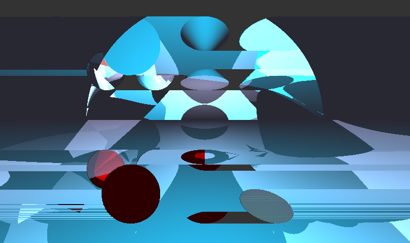
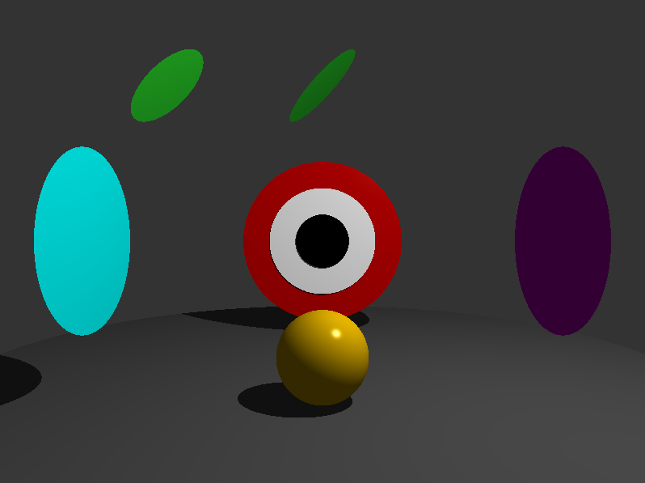

# MiniRT
*This project has been created as part of the 42 curriculum by ksuebtha, sandrzej.* \
Also known as
[Karintorn Suebthawilkul](https://github.com/Acceletor) and
[Szymon Andrzejewski](https://github.com/monandszy)



## Description
This project is an introduction to the beautiful world of Raytracing. It features a ray tracing engine written in C, with support for basic geometric objects, coupled with ambient and diffuse lighting.

## Instructions
#### Requirements:
- macOS or Linux
- minilibx

#### To build the program:
```bash
  make
```
#### To run the program execute ./miniRT with a valid scene argument:
```bash
./miniRT scenes/example.rt
```



In case of an invalid argument an error message will appear.

## .rt File Format
#### Elements:
- [A] Ambient (Background) Light [Required] 
- [C] Camera [Required]
- [pl] Infinite Plane 
- [sp] Sphere
- [ci] Circle Plane
- [tu] Tube (Cylinder without caps)
- [cy] Cylinder
- [co] Double Cone

#### Specification:
```
A <brightness>[0.0,1.0] <R,G,B>[0,255]
C <x,y,z> <x,y,z>[-1.0,1.0] <fov>
L <x,y,z> <brightness>[0.0,1.0] <R,G,B>[0,255]
pl <x,y,z> <x,y,z>[-1.0,1.0] <R,G,B>[0,255]
sp <x,y,z> <diameter>[>0.0] <R,G,B>[0,255]
ci <x,y,z> <x,y,z>[-1.0,1.0] <diameter>[>0.0] <R,G,B>[0,255]
tu <x,y,z> <x,y,z>[-1.0,1.0] <diameter>[>0.0] <height>[>=0.0] <R,G,B>[0,255]
cy <x,y,z> <x,y,z>[-1.0,1.0] <diameter>[>0.0] <height>[>0.0] <R,G,B>[0,255]
co <x,y,z> <x,y,z>[-1.0,1.0] <diameter>[>0.0] <height>[>0.0] <R,G,B>[0,255]
```
#### Example:
```
A 0.2 255,255,255
C 0,5,60 0,-0.1,-1 70
L -20,20,30 0.8 255,255,255
pl 0,-10,0 0,1,0 128,128,128
sp -20,-5,0 10.0 220,50,50
co 0,0,0 0.2,1,0.2 10.0 10.0 50,220,50
cy 20,0,0 0.2,1,0.2 10.0 10.0 50,50,220
ci -10,12,0 0,0,1 8.0 255,220,0
tu 10,12,0 1,0,-1 6.0 10.0 220,0,220
```


## Rendering Logic
Starting in `draw`, based on the initialized in `set_camera` coordinates, for each pixel, a normalized direction vector (ray), is created. The program iterates through the objects in the scene, calculating the closest valid intersection point. If the point is found, based on the normal vector of the surface. If not, the background color is rendered instead.

## Memory management

## What we learned

## Resources
https://lousodrome.net/blog/light/2017/01/03/intersection-of-a-ray-and-a-cone
https://www.scratchapixel.com/lessons/3d-basic-rendering/minimal-ray-tracer-rendering-simple-shapes/ray-sphere-intersection.html